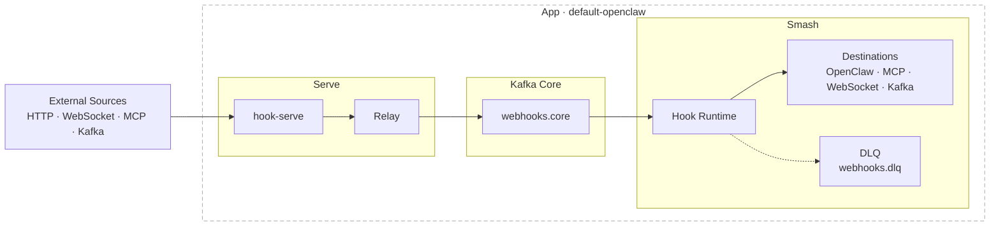

# hook 🏓 workbench - serve. relay. smash.

<p align="center">
  
</p>

> **Experimental.** This project is under active development. APIs, contracts, and runtime behavior may change without notice.

`hook` is a contract-driven event pipeline. It receives events from any source — HTTP webhooks, WebSocket frames, MCP tool calls, Kafka topics — validates and normalizes them, routes them through a durable Kafka backbone, and delivers them to any destination: message queues, HTTP services, agents, WebSocket streams, or other Kafka topics.

Three composable runtime roles: `serve` (ingest and validate), `relay` (bridge and fan-in), `smash` (deliver to egress). Everything is configured through a single `contract.toml` — no code changes to add a source, swap a destination, or change a routing rule.

## Where It Fits

Most tools in this space solve one layer:

| Tool | Layer | Gap |
|---|---|---|
| **nginx / Caddy / HAProxy** | Proxy and TLS | Forwards bytes, no event semantics or durability |
| **Svix / Hookdeck** | Managed webhook delivery | Hosted SaaS, limited routing, no self-hosted pipeline model |
| **AWS EventBridge / Google Pub/Sub** | Cloud event routing | Vendor lock-in, no self-hosted option, no ingress validation |
| **n8n / Zapier / Make** | Visual workflow automation | GUI-driven, not versionable, not composable as infrastructure |
| **RabbitMQ / Redis Streams** | Message queuing | No ingress layer, no source validation, no routing model |
| **Apache Kafka alone** | Durable event streaming | No ingress, no per-source validation, no egress adapter model |
| **socat / ngrok** | Port forwarding and tunneling | No processing, no routing, no durability |

`hook` sits between raw infrastructure and managed SaaS: self-hosted, versionable, composable, and transport-agnostic.

## The Contract Model

The pipeline is fully described by a `contract.toml`. It is the single source of truth for what enters, how it routes, and where it exits — readable by operators, reviewable as a diff, and interpretable by automated tooling.

```toml
[profiles.my-app]
serve_adapters  = ["http-ingress"]
smash_adapters  = ["openclaw-output"]
serve_routes    = ["all-to-core"]
smash_routes    = ["core-to-openclaw"]
```

- **Profiles make intent explicit.** A profile names exactly which adapters and routes are active. Swapping a profile changes the entire pipeline behavior in one field.
- **Unknown fields are rejected.** `deny_unknown_fields` is enforced everywhere. A misconfigured contract fails at validation, not at runtime under load.
- **No hidden state.** Every routing decision, retry policy, and security constraint is in the file. Nothing is inferred from environment or convention.

## What the Pipeline Guarantees

Regardless of what sends events in or what receives them out:

- **Durability** — Kafka retains every event. A downstream service going down does not lose events; delivery resumes from the last committed offset when it recovers.
- **Burst absorption** — Ingress and egress are fully decoupled. A spike of 50 events per second at ingress does not cascade to the downstream service.
- **Per-source validation** — Each source (GitHub, Linear, custom) has its own HMAC scheme and timestamp rules. Validation is fail-closed: an invalid signature returns 401, nothing is published.
- **Fan-out routing** — One event can route to multiple destinations simultaneously without re-delivering from the source.
- **Replay** — Any event retained in Kafka can be replayed against a new destination, a new configuration, or a new consumer without re-triggering the original source.
- **Transport agnosticism** — Ingress and egress are driver-based. HTTP, WebSocket, MCP, and Kafka are interchangeable at both ends. The contract maps any source to any destination through the same routing model.

## Who Uses This and Why

**You're building an AI agent that reacts to GitHub or Linear events** — You need the agent to see PR reviews, issue updates, and comments. But you don't want user-written text hitting the agent raw, and you don't want to lose events when the agent is busy. `hook` sits in front: it validates signatures, scrubs payloads, and queues everything so the agent processes at its own pace.

**You're connecting internal services via webhooks and tired of writing the same glue code** — Every new integration means another script that validates signatures, handles retries, and somehow fans out to three different consumers. With `hook`, you write a contract file instead. Add a destination, change a route, swap a source — no code, just config.

**You're running an event-driven workflow and need it to survive restarts** — Your processing service goes down for a deploy. Without a buffer, you lose whatever GitHub or Linear fired during that window. With `hook`, events wait in Kafka and drain automatically when the service comes back.

**You want to send the same event to multiple places without coordinating between them** — A PR merge should trigger a deploy pipeline, post to Slack, and update a metrics store. Right now you're either chaining services together or asking GitHub to deliver to three separate URLs. `hook` fans a single inbound event out to all destinations in one pipeline.

**You're prototyping something new and want to test it against real past traffic** — Rewind to any past event in Kafka and replay it against your new service. No need to re-trigger the source or fabricate test payloads.

See [Changelog](docs/CHANGELOG.md) for the 2026-03-04 architecture shift and plugin rollout.

## Current Architecture



Kafka remains mandatory between ingress and egress in all active profiles.

## Ingress and Egress Options

| Side | Driver | Purpose |
|---|---|---|
| serve ingress | `http_webhook_ingress` | Receive source webhooks over HTTP |
| serve ingress | `websocket_ingress` | Receive JSON frames over WebSocket |
| serve ingress | `mcp_ingest_exposed` | Expose MCP ingest endpoint for push |
| serve ingress | `kafka_ingress` | Consume external Kafka as ingestion |
| smash egress | `openclaw_http_output` | Deliver to OpenClaw hook endpoint |
| smash egress | `mcp_tool_output` | Call MCP tool via transport |
| smash egress | `websocket_client_output` | Push to external WebSocket server |
| smash egress | `websocket_server_output` | Host WebSocket endpoint and broadcast |
| smash egress | `kafka_output` | Produce to external Kafka topic |

## Plugin System (Serve and Smash)

Both sides support adapter plugins via `plugins = [...]` in contract config.

Supported plugin drivers:
- `event_type_alias`
- `require_payload_field`
- `add_meta_flag`

Behavior:
- Plugins execute in declaration order.
- `require_payload_field` fails closed when the pointer is missing.
- `add_meta_flag` writes deduplicated flags to envelope metadata.

## Repository Layout

- `src/`: `hook-serve` serve runtime
- `tools/hook/`: CLI/operator control plane (`serve`, `relay`, `smash`, ops commands)
- `apps/default-openclaw/contract.toml`: canonical compatibility contract
- `apps/kafka-openclaw-hook/`: compatibility binary wrapper for smash runtime
- `crates/hook-runtime/`: runtime execution engine (adapters + smash runtime)
- `crates/relay-core/`: shared contracts, validator, model, signatures, sanitize
- `config/kafka-core.toml`: Kafka-core defaults/schema example
- `docs/references/`: runbooks and migration/legacy references
- `firecracker/`, `systemd/`, `scripts/`: deployment and operational tooling

## Contracts and Profiles

Runtime behavior is defined in `apps/<app>/contract.toml` and activated via profile.

Contract discovery order for `hook serve` and `hook smash`:
1. `--contract <path>`
2. `--app <id>` -> `apps/<id>/contract.toml`
3. `./contract.toml`
4. embedded `default-openclaw` fallback

Important validator behavior:
- Unsupported drivers are rejected only when active in selected profile.
- Inactive unsupported drivers may exist in the same contract.
- Validation is strict fail-closed by default.

## CLI Quick Start

```bash
cargo install --path tools/hook

hook --help
hook debug capabilities
hook serve --app default-openclaw
hook relay --topics webhooks.github,webhooks.linear --output-topic webhooks.core
hook smash --app default-openclaw
```

## Environment and Config

Start from `.env.default`:

```bash
cp .env.default .env
```

Minimum required values usually include:
- `KAFKA_BROKERS`
- source auth secrets for enabled sources (`HMAC_SECRET_GITHUB`, `HMAC_SECRET_LINEAR`, etc.)
- destination auth secrets for active smash adapters (for example `OPENCLAW_WEBHOOK_TOKEN`)

Security guardrail:
- Plaintext Kafka requires explicit opt-in:
  - `KAFKA_SECURITY_PROTOCOL=plaintext`
  - `KAFKA_ALLOW_PLAINTEXT=true`

## Build and Test

```bash
cargo fmt --all
cargo clippy --workspace --all-targets -- -D warnings
cargo test --workspace
cargo build --workspace --release
```

## Release

Build release artifacts:

```bash
scripts/build-release-binaries.sh
```

Crates dry-run publish:

```bash
scripts/publish-crates.sh --dry-run
```

See:
- `docs/references/release-publishing.md`

## Additional Docs

- [apps/README.md](apps/README.md)
- [crates/README.md](crates/README.md)
- [tools/hook/README.md](tools/hook/README.md)
- [docs/README.md](docs/README.md)
- [docs/references/README.md](docs/references/README.md)
- [docs/spec.md](docs/spec.md)
- [docs/roadmap.md](docs/roadmap.md)
- [SKILL.md](SKILL.md)
