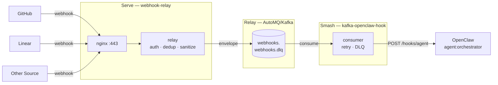

# hook - 🏓 serve. relay. smash.

<p align="center">
  
</p>

> Warning
> This project is experimental. APIs, payload shapes, and runtime behavior may change without notice.
> Breaking changes can happen between releases.

Serve (webhook-relay) — validates auth, publishes normalized envelopes to Kafka.
Relay (Kafka/AutoMQ) — buffers and distributes events across topics.
Smash (kafka-openclaw-hook) — forwards webhooks.* to OpenClaw, where agent:orchestrator takes over.

## Architecture



## Repository Layout

- `apps/README.md`: index of runtime application crates
- `crates/README.md`: index of shared library crates
- `src/`: `webhook-relay` app (Axum ingress + Kafka producer)
- `apps/kafka-openclaw-hook/`: Kafka consumer + retrying OpenClaw forwarder + DLQ producer
- `crates/relay-core/`: shared source models, signature checks, sanitizer, and parity helpers
- `deploy/nginx/webhook-relay.conf`: TLS termination/proxy config
- `docker-compose.yml`: relay deployment profile (nginx + relay)
- `docker-compose.dev.yml`: relay dev override profile (proxy trust defaults)
- `scripts/gen-certs.sh`: mTLS cert generation (CA, relay cert, consumer cert)
- `systemd/`: service units
- `memory/agent-tasks.md`: orchestrator task board

## Component Docs and Skills

- Workspace skill: `SKILL.md`
- Consumer app docs: `apps/kafka-openclaw-hook/README.md`
- Consumer app skill: `apps/kafka-openclaw-hook/SKILL.md`
- Shared crate docs: `crates/relay-core/README.md`
- Shared crate skill: `crates/relay-core/SKILL.md`

## Relay API

### `POST /webhook/{source}`

Built-in `source` handlers (examples):

- `github`
- `linear`
- `example`

Other sources can be added by implementing a handler in `src/sources/*` and registering it in `src/sources/mod.rs`.

Behavior:

- validates source auth via the selected source handler
- runs optional source-specific payload validation (example: Linear timestamp window)
- parses JSON payload
- derives `event_type`
- applies delivery dedup + per-entity cooldown
- preserves full payload and adds sanitizer risk metadata (`_sanitized`, `_flags`) before publish
- publishes envelope to topic `<RELAY_SOURCE_TOPIC_PREFIX>.{source}` asynchronously
- returns `200` fast when accepted

Event compatibility:

- GitHub: any `X-GitHub-Event` is accepted; `action` is appended when present.
- Linear: any `type` is accepted; if `type` is missing, `Linear-Event` header is used; `action` is appended when present.
- Example: `X-Example-Event` (or payload `event_type` / `type`) with optional `action`.

Compatibility references:

- GitHub events: <https://docs.github.com/en/webhooks/webhook-events-and-payloads>
- Linear webhooks: <https://linear.app/developers/webhooks>
- Linear schema objects: <https://studio.apollographql.com/public/Linear-Webhooks/variant/current/schema/reference/objects>

Compatibility tests:

- `src/sources/github.rs` -> `accepts_all_documented_github_app_events`
- `src/sources/linear.rs` -> `accepts_all_documented_linear_webhook_types`
- `src/sources/example.rs` -> `builds_dedup_key_from_delivery_action_and_entity`

Other endpoints:

- `GET /health`
- `GET /ready`

Unknown source path returns `404`.

## Envelope Schema

```json
{
  "id": "uuid-v4",
  "source": "github",
  "event_type": "pull_request.opened",
  "received_at": "2026-02-20T14:00:00Z",
  "payload": {}
}
```

## Security Controls

- IP rate limit: `100 req/min` (`tower-governor`)
- Source rate limit: `500 req/min`
- Delivery dedup TTL: `7d` (default)
- Per-entity cooldown: `30s` (default)
- Linear timestamp replay window: `60s` (default)
- Body limit: `1 MB`
- Fail-fast auth reject (`401`) with no payload logging
- AutoMQ communication over mTLS
- Consumer has no inbound ports

## Configuration

Use `.env.default` as your base:

```bash
cp .env.default .env
```

Required values to set at minimum:

- `KAFKA_BROKERS`
- `RELAY_ENABLED_SOURCES`
- `OPENCLAW_WEBHOOK_TOKEN`

For built-in example handlers:

- set `HMAC_SECRET_GITHUB` if `github` is enabled
- set `HMAC_SECRET_LINEAR` if `linear` is enabled
- set `HMAC_SECRET_EXAMPLE` if `example` is enabled

Useful optional relay controls:

- `KAFKA_SECURITY_PROTOCOL` (default `ssl`; allowed: `ssl`, `plaintext`)
- `KAFKA_ALLOW_PLAINTEXT` (default `false`; must be `true` to use `plaintext`)
- `RELAY_ENABLED_SOURCES` (default `github,linear`)
- `RELAY_SOURCE_TOPIC_PREFIX` (default `webhooks`)
- `RELAY_SOURCE_TOPICS` (optional explicit topic list; must include one topic per enabled source, e.g. `custom.github,custom.linear`)
- `RUST_LOG` (default `info`; set to `debug` for verbose ingress->Kafka->consumer->OpenClaw trace logs)
- `RELAY_DEDUP_TTL_SECONDS` (default `604800`)
- `RELAY_COOLDOWN_SECONDS` (default `30`)
- `RELAY_ENFORCE_LINEAR_TIMESTAMP_WINDOW` (default `true`)
- `RELAY_LINEAR_TIMESTAMP_WINDOW_SECONDS` (default `60`)
- `RELAY_TRUST_PROXY_HEADERS` (default `false`)
- `RELAY_TRUSTED_PROXY_CIDRS` (default `127.0.0.1/32,::1/128`)

Security note:
- Plaintext Kafka is blocked unless both `KAFKA_SECURITY_PROTOCOL=plaintext` and `KAFKA_ALLOW_PLAINTEXT=true` are set explicitly.

Useful optional consumer controls:

Agent routing (`agentId`, `sessionKey`, `model`, `deliver`, `channel`, etc.)
is configured in OpenClaw gateway `hooks.mappings` for the `agent` mapped hook,
not in the consumer. See `openclaw config get hooks.mappings`.
- `RUST_LOG` (use `debug` to include consumed Kafka payloads and OpenClaw request/response traces)
- `OPENCLAW_MESSAGE_MAX_BYTES` (default `4000`)
- `OPENCLAW_HTTP_TIMEOUT_SECONDS` (default `20`)

## Add A Source

GitHub and Linear are built-in examples, not the architecture limit.

To add a new source:

1. Create `src/sources/<your_source>.rs` implementing `SourceHandler`.
2. Register the handler in `src/sources/mod.rs` (`SOURCE_HANDLERS`).
3. Add the source to `RELAY_ENABLED_SOURCES`.
4. Ensure the auth secret/env needed by your handler is configured.
5. Add the source topic to consumer `KAFKA_TOPICS` (or rely on your topic pattern).

## Build and Test

Prerequisites:

- Rust stable
- OpenSSL
- CMake (for `rdkafka-sys`)
- libcurl headers/dev package (for `rdkafka-sys` on Linux)

Run:

```bash
cargo test --workspace
cargo build --workspace --release
```

Build release archives (checksums included):

```bash
scripts/build-release-binaries.sh
```

HTTP behavior smoke test (against a running relay):

```bash
HMAC_SECRET_GITHUB=... HMAC_SECRET_LINEAR=... scripts/smoke-test-rust.sh --relay-url http://127.0.0.1:8080
```

Crates publish dry-run:

```bash
scripts/publish-crates.sh --dry-run
```

## Install

### Prebuilt binaries (GitHub Releases)

Download the tarball for your target from:

- `webhook-relay-<target-triple>.tar.gz`
- `kafka-openclaw-hook-<target-triple>.tar.gz`

Example (`x86_64-unknown-linux-gnu`):

```bash
VERSION=v0.2.0
curl -LO "https://github.com/heyAyushh/webhook-relay/releases/download/${VERSION}/webhook-relay-x86_64-unknown-linux-gnu.tar.gz"
curl -LO "https://github.com/heyAyushh/webhook-relay/releases/download/${VERSION}/kafka-openclaw-hook-x86_64-unknown-linux-gnu.tar.gz"
tar -xzf webhook-relay-x86_64-unknown-linux-gnu.tar.gz
tar -xzf kafka-openclaw-hook-x86_64-unknown-linux-gnu.tar.gz
sudo install -m 0755 webhook-relay /usr/local/bin/webhook-relay
sudo install -m 0755 kafka-openclaw-hook /usr/local/bin/kafka-openclaw-hook
```

### Install from crates.io

```bash
cargo install webhook-relay --locked
cargo install kafka-openclaw-hook --locked
```

Use shared library crate in your project:

```bash
cargo add relay-core
```

## Zero-Lift Init

Bootstrap everything with one command:

```bash
scripts/init.sh --up
```

By default, this starts the `dev` compose profile (relay with dev overrides).
For explicit relay profile:

```bash
scripts/init.sh --up --profile relay
```

What this does:

- creates `.env` from `.env.default` if missing
- generates strong random secrets for placeholder values
- generates AutoMQ mTLS certs via `scripts/gen-certs.sh`
- generates local TLS certs for nginx (`certs/tls.crt`, `certs/tls.key`)
- writes ready-to-use systemd env files to `deploy/env/`
- optionally starts stack with `docker compose up --build -d`

## mTLS Certificates

Generate local cert material:

```bash
scripts/gen-certs.sh
```

Outputs:

- `certs/ca.crt`, `certs/ca.key`
- `certs/relay.crt`, `certs/relay.key`
- `certs/consumer.crt`, `certs/consumer.key`

## Run with Docker Compose

Relay profile (VM/public ingress, relay-only):
```bash
docker compose -f docker-compose.yml up --build
```

Relay dev override profile:

```bash
docker compose -f docker-compose.yml -f docker-compose.dev.yml up --build
```

Services:

- `nginx` on `443`
- `webhook-relay`

`kafka-openclaw-hook` runs as a native binary (for example via systemd), not in Docker.

## Release and Publish

- CI workflow: `.github/workflows/ci.yml`
- Binary release workflow (tags `v*`): `.github/workflows/release-binaries.yml`
- Crates publish workflow (manual dispatch): `.github/workflows/publish-crates.yml`
- Local helper scripts:
  - `scripts/build-release-binaries.sh`
  - `scripts/publish-crates.sh`

Operational release runbook:

- `references/release-publishing.md`

## Systemd Deployment

Install units:

- `systemd/webhook-relay.service`
- `systemd/kafka-openclaw-hook.service`

Then:

```bash
sudo systemctl daemon-reload
sudo systemctl enable --now webhook-relay
sudo systemctl enable --now kafka-openclaw-hook
```

## Orchestrator Contract

Consumer forwards all events to the same session:

- `agentId = agent`
- `sessionKey = agent:orchestrator`
- `channel = telegram`
- `to = <configured-in-openclaw-hook-mapping>`

Task board file:

- `memory/agent-tasks.md`
